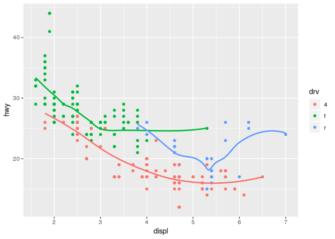
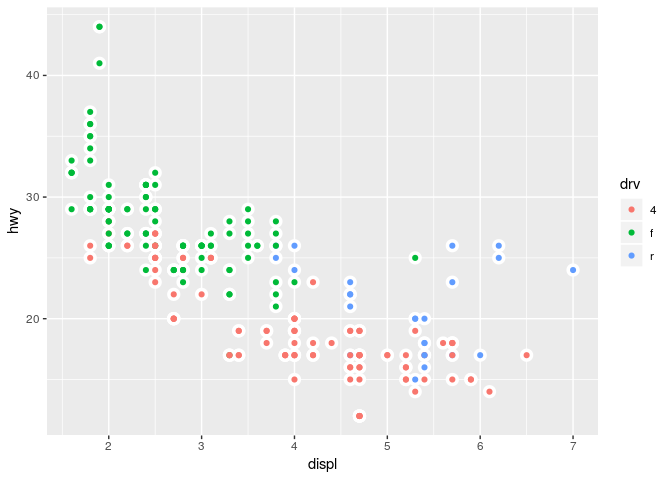
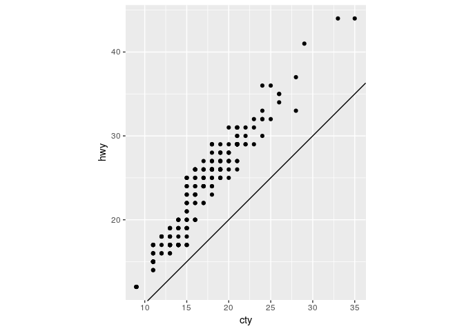
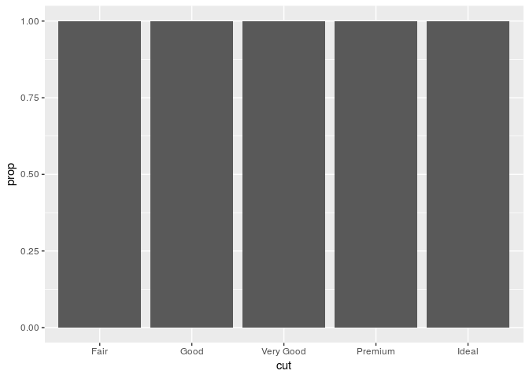

Homework 2: ggplot
================
2019-03-09

``` r
library(tidyverse)
```

    ## ── Attaching packages ──────────────────────────────────────────────────────────────────────────────────────────────────────────────────────── tidyverse 1.2.1 ──

    ## ✔ ggplot2 3.1.0       ✔ purrr   0.3.1  
    ## ✔ tibble  2.0.1       ✔ dplyr   0.8.0.1
    ## ✔ tidyr   0.8.3       ✔ stringr 1.4.0  
    ## ✔ readr   1.3.1       ✔ forcats 0.4.0

    ## ── Conflicts ─────────────────────────────────────────────────────────────────────────────────────────────────────────────────────────── tidyverse_conflicts() ──
    ## ✖ dplyr::filter() masks stats::filter()
    ## ✖ dplyr::lag()    masks stats::lag()

  - Take the first faceted plot in this section:

<!-- end list -->

``` r
ggplot(data = mpg) + 
  geom_point(mapping = aes(x = displ, y = hwy)) + 
  facet_wrap(~ class, nrow = 2)
```

<!-- -->

What are the advantages to using faceting instead of the colour
aesthetic? What are the disadvantages? How might the balance change if
you had a larger dataset? Faceting could easily resolve complicated plot
consisting of several datasets within one coordinate space. The problems
begin when number of datasets are growning bigger and we could
potentially create tens or hundres plot based in the same coordinate
space. Their analysis as whole become more diffucult because we could
not divide our focus equally between all drawed plots.

  - Recreate the R code necessary to generate the following
graphs.

<!-- end list -->

``` r
knitr::include_graphics(paste0("plots/fig", 1:6, ".png"))
```


``` r
#1.png
ggplot(data = mpg, mapping = aes(x = displ, y = hwy)) + 
  geom_point() + 
  geom_smooth(se = FALSE)
```

    ## `geom_smooth()` using method = 'loess' and formula 'y ~ x'

<!-- -->

``` r
#2.png
ggplot(data = mpg, mapping = aes(x = displ, y = hwy)) +
  geom_point() +
  geom_smooth(aes(group = drv), se = FALSE, show.legend = FALSE)
```

    ## `geom_smooth()` using method = 'loess' and formula 'y ~ x'

<!-- -->

``` r
#3.png
ggplot(data = mpg, mapping = aes(x = displ, y = hwy, color = drv)) +
  geom_point() +
  geom_smooth(aes(group = drv), se = FALSE, show.legend = FALSE)
```

    ## `geom_smooth()` using method = 'loess' and formula 'y ~ x'

<!-- -->

``` r
#4.png
ggplot(data = mpg, mapping = aes(x = displ, y = hwy)) +
  geom_point(aes(color = drv)) +
  geom_smooth(se = FALSE)
```

    ## `geom_smooth()` using method = 'loess' and formula 'y ~ x'

<!-- -->

``` r
#5.png
ggplot(data = mpg, mapping = aes(x = displ, y = hwy)) + 
  geom_point(aes(color = drv)) + 
  geom_smooth(aes(linetype = drv),se = FALSE)
```

    ## `geom_smooth()` using method = 'loess' and formula 'y ~ x'

<!-- -->

``` r
#6.png
ggplot(data = mpg, mapping = aes(x = displ, y = hwy)) + 
  geom_point(color = "white", size = 4) +
  geom_point(aes(color = drv))
```

<!-- --> - Most geoms
and stats come in pairs that are almost always used in concert. Read
through the documentation and make a list of all the pairs. What do they
have in common? | geom | stat | |———————|———————| | `geom_bar()` |
`stat_count()` | | `geom_bin2d()` | `stat_bin_2d()` | | `geom_boxplot()`
| `stat_boxplot()` | | `geom_contour()` | `stat_contour()` | |
`geom_count()` | `stat_sum()` | | `geom_density()` | `stat_density()` |
| `geom_density_2d()` | `stat_density_2d()` | | `geom_hex()` |
`stat_hex()` | | `geom_freqpoly()` | `stat_bin()` | | `geom_histogram()`
| `stat_bin()` | | `geom_qq_line()` | `stat_qq_line()` | | `geom_qq()` |
`stat_qq()` | | `geom_quantile()` | `stat_quantile()` | |
`geom_smooth()` | `stat_smooth()` | | `geom_violin()` | `stat_violin()`
| | `geom_sf()` | `stat_sf()` | They use similar naming across the
function.

  - Compare and contrast geom\_jitter() with geom\_count().

`geom_jitter` randomly creates deviation around dataset points to get
better understanding of overlapped points by inducing artificial noise
into the dataset. `geom_count` is better function to dicriminate and
quantify number of overlapped datapoints across the dataset. It shows
certain number of overlapped values at any point in plot.

  - What does the plot below tell you about the relationship between
    city and highway mpg (fuel consumption)? Why is coord\_fixed()
    important? What does geom\_abline() do?

<!-- end list -->

``` r
ggplot(data = mpg, mapping = aes(x = cty, y = hwy)) +
  geom_point() + 
  geom_abline() +
  coord_fixed()
```

<!-- -->

``` r
# They are correlated mostly linearly. If city mpg value is higher, then hwy mpg is also high. The most economical cars, in terms of consumption of fuel,
# are placed in the upper part of graph, whereas cars with high consumption of fuel are placed mostly at the bottom of plot.
#coord_fixed is neccessary to keep y/x ratio constant across the plot in order to show more consice information without screwing up the perception of plot 
#geom_abiline() calculate and plot linear model slope and intercept in relationship to dataset
```

  - What is the default geom associated with stat\_summary()?

<!-- end list -->

``` r
ggplot(data = diamonds) + 
  stat_summary(
    mapping = aes(x = cut, y = depth),
    fun.ymin = min,
    fun.ymax = max,
    fun.y = median
  )
```

<!-- -->

``` r
#geom_pointrange() == stat_summary()
```

How could you rewrite the previous plot to use that geom function
instead of the stat function?

``` r
ggplot(data = diamonds) +
  geom_pointrange(
    mapping = aes(x = cut, y = depth),
    stat = "summary",
    fun.ymin = min,
    fun.ymax = max,
    fun.y = median
  )
```

<!-- -->

  - What does geom\_col() do? How is it different to geom\_bar()? If you
    want the heights of the bars to represent values in the data, use
    geom\_col()

  - What variables does stat\_smooth() compute? What parameters control
    its behaviour? Calculation is performed by the (currently
    undocumented) predictdf generic function and its methods. For most
    methods the confidence bounds are computed using the predict method
    - the exceptions are loess which uses a t-based approximation, and
    for glm where the normal confidence interval is constructed on the
    link scale, and then back-transformed to the response scale.

<!-- end list -->

1.  y - predicted value
2.  ymin - lower pointwise confidence interval around the mean
3.  ymax - upper pointwise confidence interval around the mean
4.  se - standard error

Method, formula, fullrange, level, n, na.rm are parameters which
controls how stat\_smooth behaves

  - In our proportion bar chart, we need to set group = 1. Why? In other
    words what is the problem with these two graphs?

<!-- end list -->

``` r
ggplot(data = diamonds) + 
  geom_bar(mapping = aes(x = cut, y = ..prop..))
```

<!-- -->

``` r
ggplot(data = diamonds) + 
  geom_bar(mapping = aes(x = cut, fill = color, y = ..prop..))
```

<!-- -->

``` r
#If group is not set to 1, then all the bars have prop == 1. The function geom_bar assumes that the groups are equal to the x values, since the stat computes the counts within the group.
```
